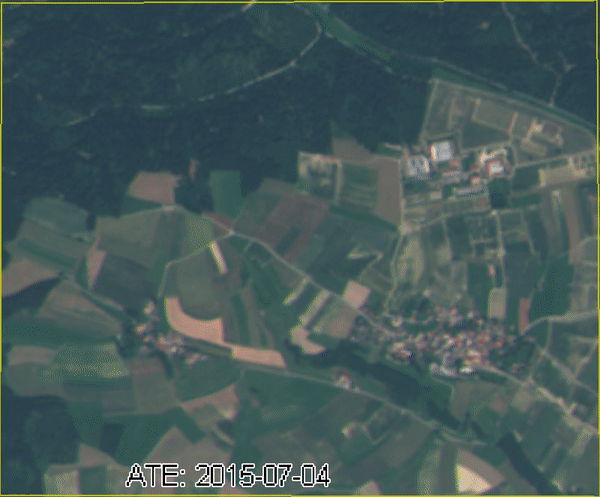

**cite**

If you find the data and code interesting, we would appreciate a citation.

```bibtex
@article{marszalek2020self,
  title={Multi-Temporal Crop Type and Field Boundary Classification with Google Earth Engine},
  author={Marszalek, M.; L{\"o}sch, M.; K{\"o}rner, M.; Schmidhalter, U.},
  journal={MDPI preprint doi: 10.20944/preprints202004.0316.v1},
  year={2020}
}
```

Source:
[Marszalek, M.; Lösch, M.; Körner, M.; Schmidhalter, U. (2020), *Multi-Temporal Crop Type and Field Boundary Classification with Google Earth Engine*](https://www.researchgate.net/publication/340769396_Multi-Temporal_Crop_Type_and_Field_Boundary_Classification_with_Google_Earth_Engine)


## Environment setup for Python3

Create a new virtual environment with

    python3 -m venv env
    
activate it

    source env/bin/activate
    
install requirements

    pip3 install -r requirements.txt 
    
and enjoy

    jupyter lab notebook/CropType.ipynb

## Introduction

The following code snippets show examples of how a classification can be carried out with the sources and what data is required for this. We would be pleased if you test and compare your methods with the same data.

## Crop Data

The data is loaded as follows:

```python
fp = "../data/crop-data/Test_area.shp"
gpd_frame = gpd.read_file(fp)
gpd_frame.head()
```

The codes in column "NC_ant" stand for:<br/>
Potato: 600<br/>
Winter barley: 131<br/>
Corn: 400<br/>
Winter rapeseed: 311<br/>
Winter wheat: 115<br/>
Sugar beet: 603<br/>
Other: 1<br/>

## Satellite Data

The satellite data have a temporary resolution of 2 weeks and include the average values for raw bands (B1-B12), NDVI, NDWI, REIP and NDWI. 
A total of 2099 fields were randomly selected in Upper Bavaria and corresponding Sentinel-2 data from February to August were added.
The data is already preprocessed and downloaded form Google Earth Engine.
(interpolation: 2 weeks, Scene meta cloud filter: 20%)<br/>

We provide two data sets (data2016-2018.xlsx and testdata.xlsx).
The test data set is an independent data set with fields near Dürnast, Freising in 2018 with additional 301 crop records. <br/>




## Classification

The CropType notebook describes the classification based on a trained model. The record contains various satellite data if you want to train your own model.

```python
# load the model 2016-2018
filename='../model/model_RF_bands_161718_withoutother.sav'
loaded_model = pickle.load(open(filename, 'rb'))

#predict label
y_pred = loaded_model.predict(X=X)
```


## Acknowledgment
StMELF, the Bavarian State Ministry of Agriculture and Forestry supported this research with its crop type data set.
The StMELF data set under data/crop-data is free for research activites.
[](https://creativecommons.org/licenses/by-nc/4.0/)